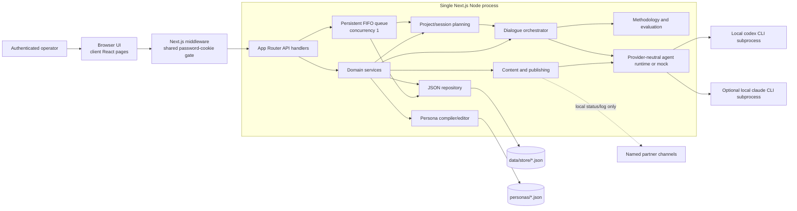
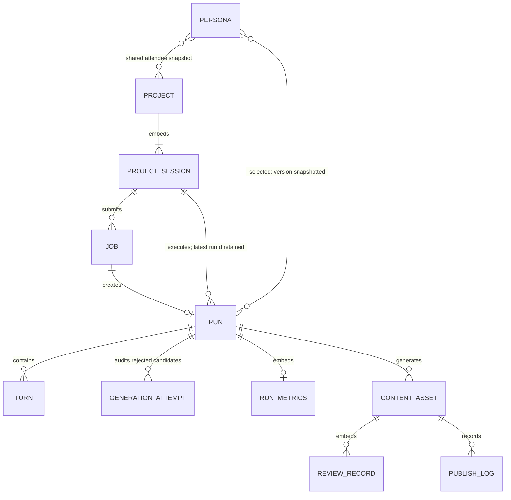
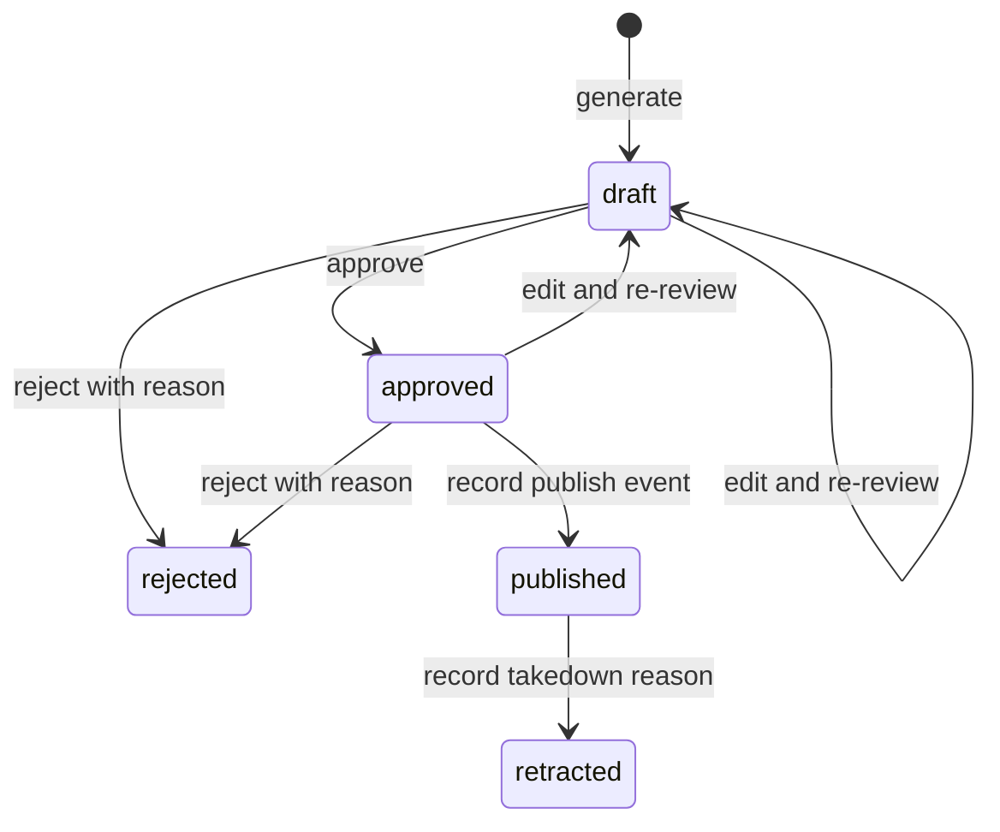

# Digital Bridges NYC Architecture

Status: as-built reference, verified against the repository on 2026-07-20.

This document describes the implementation that exists today. `README.md`, `docs/TOOLKIT.md`,
and `EPICS_AND_USER_STORIES.md` describe product intent; where they differ from the code, this
document follows the code.

## 1. Purpose and architectural shape

Digital Bridges NYC is a password-gated research and demonstration application for planning and
running facilitator-led Reflective Structured Dialogue (RSD) between fictional Muslim and Jewish
LLM personas. Its primary unit is a persistent `Project`: one shared roster participates in a series
of independently configured `ProjectSession` records, each of which creates an ordinary `Run`. A run
produces a transcript, methodology and dialogue-dynamics signals, a judge evaluation, and optionally
a set of campaign-content drafts that enter a human review workflow.

The application is a single-node, full-stack Next.js system:

- Next.js 16 App Router and React 19 provide the UI and same-origin JSON API.
- Feature pages are client components; they fetch data from route handlers after mounting.
- Route handlers execute domain services in the same Node.js process.
- Real agent calls go through a provider-neutral runtime that spawns either the locally
  authenticated Codex CLI (the default) or the optional Claude CLI. The default real configuration
  is Codex with `gpt-5.5` at `medium` reasoning effort. Mock mode replaces either provider with
  deterministic local generators.
- The browser dashboard is intentionally narrower than the server runtime: it always creates Codex
  projects and runs and exposes only a curated GPT model dropdown plus reasoning effort. Claude is
  available only to server API/configuration consumers, not as a dashboard selection.
- Project, job, run, accepted-turn, rejected-generation-attempt, semantic-validation-attempt,
  content, and publishing records are stored in JSON files. Persona definitions are separate JSON
  source files; authored narrative fields are editable, while identity, group, fictional status,
  and student `raisedIn` are immutable through the editor/API.
- Project-session execution uses a persistent, process-local FIFO queue and one request-detached
  worker loop in the Next.js Node process. There is no separate worker service, database server,
  cache, or outbound publishing integration.

The system is designed as a local/single-instance tool, not as a horizontally scaled service.

## 2. Ethical and product invariants

These rules are architectural constraints, not merely presentation text:

1. Personas must be synthetic. `lib/personas.ts` rejects persona files unless
   `fictional: true`.
2. The student roster is exactly 15 Muslim and 15 Jewish personas. Every student has a structured
   `raisedIn` location naming a neighborhood, one of the five boroughs, and New York City; each
   community covers all five boroughs. One facilitator and one judge bring the corpus to 32 records.
3. A student's own NYC upbringing is independent of family origin. Parents and extended family may
   originate anywhere, represented in the narrative and `regionalHistory` fields.
4. Generated campaign assets carry model/run/persona/methodology provenance and a mandatory
   AI-generated disclosure.
5. An asset must be approved before the publishing workflow accepts it.
6. Reviews and publish/takedown events are retained as audit records.
7. Evaluation values describe the simulated conversation only; they are not evidence of real-world
   reconciliation.
8. Persona agents are one-turn text generators. They do not share system prompts or persistent
   agent sessions with one another.
9. Project challenge roles are balanced across the two selected communities and assigned once per
   project; up to two distinct assigned voices, one per community, may challenge in a discussion go-round, rotating by
   project session and discussion-round index. Introductions are challenge-free. A challenge targets
   the freshest eligible ordinary contribution, remains semantically faithful to it, and is bounded
   away from threats, slurs, dehumanization, and incitement. A detected escalating/polarizing
   discussion turn must be followed immediately by a linked facilitator intervention. When that
   intervention names an attendee in its closing invitation, that attendee responds immediately
   without opening a new question. If that attendee owns the exact next scheduled slot in the same
   go-round, the one
   integrated response also fulfills that slot; otherwise the scheduled slot remains later.
10. Every persisted facilitator opening starts with Sam identifying himself, immediately states the
    complete sanitized configured topic, and asks a question grounded in that same topic. Invalid or
    off-topic provider output receives bounded retries and then a topic-preserving local fallback;
    a generic replacement topic is never substituted for safe configured data.
    Project session 1 alone also presents the persisted project introduction and Sam's profile-backed
    degree and professional background; later sessions cannot repeat those project-level details.
11. Safe configured topics remain explicit throughout every non-introduction generation phase,
    including political and geopolitical topics. Responses may describe first-person, family, and
    NYC lived impact, but may not turn into partisan persuasion, collective blame, dehumanization,
    threats, or incitement. Introduction turns alone are exempt from topic-relevance enforcement.
12. Internal prompt/data-handling prose is never accepted as visible dialogue. Exact rejected text
    remains in the generation-attempt audit store, while accepted Turns, copied challenge anchors,
    local fallbacks, campaign assets, and judge rationale exclude prompt scaffolding.
13. A public-conflict topic cannot be satisfied by topic words alone. Non-introduction persona
    dialogue must connect it to a concrete human consequence, ethical tension, uncertainty, or New
    York impact.
14. A persona's authored profile is the exhaustive source of personal biography. Generated turns
    may not invent relationships, teachings, quotations, events, routines, settings, routes, travel,
    losses, or other personal facts, and may not materially recycle recent dialogue.
15. Facilitator validation is phase-specific: openings establish identity/topic/shared agreements;
    one-sentence transitions procedurally enter every go-round after the first; interventions reflect
    and route one focused repair question without self-positioning; closings preserve supported
    connection and unresolved difference without manufacturing consensus and explicitly thank
    participants for taking part.
16. Accepted visible dialogue is plain text. Balanced Markdown decoration is removed before
    validation and persistence, and evaluation covers the complete visible transcript plus its
    challenge/repair relationships.

The current implementation does **not** enforce advisor sign-off before a persona is used. That is
a documented governance requirement and a production-hardening item, described later.

## 3. System context



The dashed partner edge is intentionally not an integration: choosing “Publish” changes local state
and appends a log entry. No content is sent to Columbia Hillel, an MSA, a social network, or any
other external system.

## 4. Runtime boundaries and dependency direction

| Layer | Main location | Responsibility | Runtime |
|---|---|---|---|
| UI shell | `app/layout.tsx`, `app/globals.css` | Metadata, navigation, global styling | React server shell + CSS |
| Feature UI | `app/**/page.tsx`, `app/logout-button.tsx` | Forms, local state, API calls, rendering | Browser (`"use client"`) |
| Shared UI | `app/ui.tsx`, `app/models.ts`, `lib/gptModels.ts` | Fetch wrapper, formatters, badges, Codex GPT model/reasoning options | Browser-safe |
| Access gate | `middleware.ts`, `lib/auth.ts` | Password token verification and redirects/401s | Middleware/Web Crypto |
| HTTP API | `app/api/**/route.ts` | Parse requests and serialize domain results | Node route handlers |
| Domain services | `lib/jobQueue.ts`, `lib/projects.ts`, `lib/orchestrator.ts`, `lib/content.ts`, `lib/publishing.ts` | Persistent job execution, project/session planning, dialogue, generation, review lifecycle | Node only |
| Domain policy | `lib/jobRules.ts`, `lib/projectRules.ts`, `lib/methodology.ts`, `lib/challengeCadence.ts`, `lib/dialogueQuality.ts`, `lib/dialogueFlow.ts`, `lib/evaluation.ts`, `lib/personas.ts` | FIFO/job transitions, project cardinality/sampling, prompts, phase-specific dialogue validation, metrics, persona rules | Mostly pure; persona I/O is Node only |
| Agent runtime | `lib/agent.ts`, `lib/codexProtocol.ts`, `lib/mockClaude.ts` | Provider dispatch, CLI process management/protocol parsing, or deterministic mock output | Node/OS process |
| Persistence | `lib/db.ts`, `personas/*.json` | Runtime records and persona source | Local filesystem |
| Contracts/config | `lib/types.ts`, `lib/providers.ts`, `lib/config.ts` | Shared types, provider defaults/normalization, and environment-derived settings | Browser-safe contracts / server config |

The intended dependency direction is:

```text
browser pages -> same-origin API -> domain service -> adapter/repository -> OS/filesystem
```

Client code must not import runtime values from modules that use `node:fs`, `node:crypto`, or
`node:child_process`. Type-only imports from `lib/types.ts` are safe. The route handlers must remain
on the Node runtime because the core services require filesystem and subprocess access.

## 5. Repository map

```text
app/
  layout.tsx                  Shared shell, navigation, metadata, footer
  page.tsx                    Project creation and project-list dashboard
  login/page.tsx              Shared-password login
  personas/page.tsx           Persona editor
  projects/[id]/page.tsx      Shared roster, session setup, job controls, and run links
  jobs/page.tsx               Active controls/status, history, cumulative active time, result links
  runs/[id]/page.tsx          Transcript, metrics, lazy audit browser, content-generation action
  content/page.tsx            Review, approval, publish, and takedown UI
  showcase/page.tsx           Read-only run/content presentation
  api/                        Dynamic JSON route handlers
  ui.tsx                      Browser-safe fetch and presentation helpers
  models.ts                   Dashboard GPT model/reasoning selector values
  globals.css                 Entire visual system
  api/projects/**             Project/session read, configuration, and execution routes
  api/jobs/route.ts           Persistent job-list endpoint and worker recovery kick
  api/jobs/[id]/route.ts      Job detail plus pause/continue/kill controls
  api/runs/[id]/attempts/**   Paginated redacted audit summaries and exact detail
  api/runs/[id]/validations/** Paginated validator summaries and exact run-scoped detail
lib/
  jobQueue.ts                 Single worker, control/resume execution, persistence, recovery
  jobRules.ts                 Pure job FSM, priority claim, and cumulative active timing
  projects.ts                 Persistent Project -> ProjectSession -> Run planning service
  projectRules.ts             Pure project/session sampling, shell, status, and round-cap rules
  orchestrator.ts             Run lifecycle, dialogue loop, safe control checkpoints, resume
  facilitatorOpening.ts       Pure opening identity/order/topic/invitation assessment and scaffold
  deterministicTurnGate.ts    Literal hard-safety, output-hygiene, and routing pre-gate
  semanticValidator.ts        Independent full-context LLM acceptance and dialogue routing
  semanticValidationAttempts.ts Redacted validator-audit read model and pagination
  topicRelevance.ts           Pure topic normalization, anchor extraction, and grounding assessment
  challengeCadence.ts         Rotating two-challenges-per-discussion-round selection
  dialogueQuality.ts          Plain-text, persona, novelty, topic-substance, challenge-fidelity gates
  dialogueFlow.ts             Phase-specific intervention structure and invitee routing checks
  agent.ts                    Provider-neutral CLI dispatch, shared pool, timeout, and retry
  codexProtocol.ts            Pure Codex argv builder and JSONL parser
  gptModels.ts                Browser-safe selectable GPT model catalog
  providers.ts                Browser-safe provider/model defaults and compatibility helpers
  mockClaude.ts               Deterministic dialogue/judge/content generators
  personas.ts                 Persona validation, cache, editing, prompt compilation
  personaRules.ts             Exact 15+15 roster and NYC-upbringing invariants
  methodology.ts              Versioned RSD rules, compliance, and conversation-dynamics heuristics
  evaluation.ts               Judge invocation and metrics computation
  content.ts                  Five-asset campaign draft generation
  publishing.ts               Review, approval, publish, and takedown transitions
  generationAttempts.ts       Redacted audit summaries and pagination rules
  db.ts                       JSON-file repository
  auth.ts                     Shared-password and cookie-token logic
  apiHelpers.ts               JSON success/error mapping
  config.ts                   Server environment configuration
  types.ts                    Domain contracts
  hash.ts, logger.ts          IDs/provenance hashes and structured console logs
instrumentation.ts            Starts/reconciles the queue on Node server startup
config/
  codex-agent-instructions.md Text-only base instructions for Codex subprocesses
personas/                     30 students, one facilitator, one judge (32 JSON records)
data/store/                   Generated runtime data; git-ignored
scripts/seed-personas.mjs     Destructively regenerates persona JSON from seed data
tests/unit.test.mjs           Pure methodology/mock unit tests
tests/provider.test.mjs       Provider defaults, GPT catalog, Codex argv, and JSONL protocol tests
tests/personas.test.mjs       Roster, NYC upbringing, borough coverage, and rejection tests
tests/projects.test.mjs       Project rules, dynamics classification, and project mock-mode tests
tests/jobs.test.mjs           Job schema, FIFO/concurrency transitions, timing, and persistence tests
tests/job-controls.test.mjs   Job control FSM, priority, pause withdrawal, and timing tests
tests/generation-attempts.test.mjs
                              Audit persistence, redaction, pagination, permissions, corruption tests
tests/orchestrator-audit.test.mjs
                              Attempt capture across dialogue phases
tests/orchestrator-resume.test.mjs
                              Safe-bundle pause/cancel and same-Run resume tests
tests/challenge-cadence.test.mjs
                              One rotating challenge voice per discussion go-round
tests/dialogue-quality.test.mjs
                              Persona/novelty/topic/challenge-fidelity quality gates
tests/facilitator-phase-validation.test.mjs
                              Opening, intervention, reply, and closing phase checks
tests/orchestrator-format-normalization.test.mjs
                              Plain-text normalization before validation and persistence
tests/evaluation-quality.test.mjs
                              Full-transcript judge context and quality-risk metrics
docs/TOOLKIT.md               Ethical and adaptation guide
```

`process.cwd()` resolves `personas/` and the default `data/store/`. `DBRIDGES_STORE_DIR`, when set,
is resolved with `path.resolve()` and replaces only the runtime-store location. The production
process must still start in the repository root for personas and have write permission to the chosen
store plus persona files when editing them.

## 6. Web application and API surface

### Browser routes

| Route | Component | Main behavior |
|---|---|---|
| `/login` | `app/login/page.tsx` | Submits the shared password and redirects to `next` or `/`. |
| `/` | `app/page.tsx` | Loads projects, personas, and health; creates a persistent project and lists existing projects. |
| `/personas` | `app/personas/page.tsx` | Loads full persona records and saves edits. |
| `/projects/[id]` | `app/projects/[id]/page.tsx` | Displays the shared roster and one-time challenge assignments; configures, queues, and removes session plans; removes the project; polls active jobs and links to their controls in Jobs. |
| `/jobs` | `app/jobs/page.tsx` | Groups all active control states separately from terminal history; exposes Pause, Continue, and Kill where valid; shows cumulative active time, errors, and transcript links. |
| `/runs/[id]` | `app/runs/[id]/page.tsx` | Loads a run, accepted turns, and only the rejected-attempt count initially; lazily fetches paginated redacted summaries and one exact detail at a time; renders evaluation and generates campaign drafts. |
| `/content` | `app/content/page.tsx` | Lists and filters assets; performs review and publishing actions. |
| `/showcase` | `app/showcase/page.tsx` | Presents evaluated runs and locally published assets. |

Every feature page above is client-rendered and uses `useEffect` plus local React state. There is no
server-side feature-data loading, transcript progress stream, Suspense boundary, or shared
query/cache library. While a project session's linked job is in any nonterminal state—`queued`,
`running`, `pause-requested`, `paused`, or `cancel-requested`—the project detail page polls
`GET /api/projects/[id]` every three seconds. The Jobs page polls `GET /api/jobs` on the same interval
while any job is nonterminal and updates cumulative active-time displays every second. Session
submission returns 202 after persistent queue acceptance, so refreshing, navigating away, or closing
the browser does not cancel the work. Reopening `/projects/[id]` or `/jobs` re-reads persisted state.
On run detail, the rejected-attempt summary request is deferred until the outer audit disclosure is
opened, and an exact record is requested only when its row is expanded. The root layout is shared by
the login page as well, so the normal navigation and footer also surround `/login`.

Despite its presentation-oriented name, `/showcase` is protected by the same middleware as the rest
of the workspace; it is not a public route.

### JSON API

All API handlers are marked `dynamic = "force-dynamic"`.

| Method and route | Service/read model | Result |
|---|---|---|
| `POST /api/login` | `lib/auth.ts` | Sets the auth cookie or returns 401. |
| `POST /api/logout` | Cookie store | Deletes the auth cookie. |
| `GET /api/health` | Config + provider preflights | Default provider/model/reasoning/budget settings and availability for Codex and Claude. |
| `GET /api/metrics` | Full run/asset/log scans | Aggregate program metrics. |
| `GET /api/personas?full=1` | `lib/personas.ts` | Persona summaries or full records. |
| `GET /api/personas/[id]` | `lib/personas.ts` | One persona. |
| `PATCH /api/personas/[id]` | `updatePersona()` | Atomically edits the persona and bumps its patch version. |
| `GET /api/projects` | `listProjects()` | All projects, newest first, with embedded session shells. |
| `POST /api/projects` | `createProject()` | Creates the project, shared roster snapshot, one-time balanced challenge assignment, and X sessions. |
| `GET /api/projects/[id]` | `getProject()` | One complete project aggregate. |
| `DELETE /api/projects/[id]` | `deleteProject()` | Removes the mutable project aggregate while preserving its historical Jobs, Runs, turns, and audit records. Returns 409 while linked work is active. |
| `GET /api/projects/[id]/sessions/[sessionId]` | Project read model | `{ project, session }`. |
| `PATCH /api/projects/[id]/sessions/[sessionId]` | `configureProjectSession()` | Sets one session's `topic` and `rounds`. |
| `DELETE /api/projects/[id]/sessions/[sessionId]` | `deleteProjectSession()` | Removes one idle session plan without renumbering survivors or deleting historical execution records; the project's last session cannot be removed separately. |
| `POST /api/projects/[id]/sessions/[sessionId]/run` | `enqueueProjectSessionJob()` | Persists a job, marks the session queued, and returns HTTP 202 with `{ job, project, reused }`. |
| `GET /api/jobs` | `listJobs()` plus `startJobWorker()` | All jobs, newest first; also kicks recovery/draining if needed. |
| `GET /api/jobs/[id]` | `getJob()` | One persistent Job record as `{ job }`. |
| `PATCH /api/jobs/[id]` | `controlProjectSessionJob()` | Accepts `{ action: "pause" | "continue" | "kill" }` and returns `{ job, project }`. |
| `GET /api/runs` | `listRuns()` | All runs, newest first. |
| `POST /api/runs` | `startRun()` | Legacy-compatible one-off execution; runs the complete dialogue and returns its terminal record. |
| `GET /api/runs/[id]` | Run + turn + audit-count repositories | `{ run, turns, rejectedAttemptCount, semanticValidationCount }`; full audit artifacts are excluded. |
| `GET /api/runs/[id]/attempts?page=&pageSize=` | Generation-attempt summary read model | `{ attempts, page, pageSize, total, totalPages }`; defaults to 20 rows per page, caps `pageSize` at 50, and omits prompt/response bodies. |
| `GET /api/runs/[id]/attempts/[attemptId]` | Run-scoped generation-attempt lookup | `{ attempt }` with the one exact full record, only when the attempt belongs to that Run. |
| `GET /api/runs/[id]/validations?page=&pageSize=` | Semantic-validation summary read model | `{ validations, page, pageSize, total, totalPages }`; defaults to 20 rows per page, caps `pageSize` at 50, and omits full prompts, candidate text, and raw validator output. |
| `GET /api/runs/[id]/validations/[validationId]` | Run-scoped semantic-validation lookup | `{ validation }` with the one exact full record, only when the validation belongs to that Run. |
| `POST /api/runs/[id]/generate` | `generateCampaignContent()` | Creates and returns five new draft assets. |
| `GET /api/content?status=&runId=` | Asset + publish-log repositories | Filtered assets with publish history. |
| `POST /api/content/[id]/review` | `reviewAsset()` | Approves, rejects, or edits an asset. |
| `POST /api/content/[id]/publish` | `publishAsset()` | Records a local publish event and status. |
| `POST /api/content/[id]/takedown` | `takedownAsset()` | Records a local takedown and retraction status. |

`POST /api/projects/[id]/sessions/[sessionId]/run` only performs the short queue submission.
`enqueueProjectSessionJob()` persists the session/job association before returning 202 and starts the
request-detached process-wide worker. Repeated submission while that session has any nonterminal Job
reuses that record rather than starting duplicate model work. Normal selection is FIFO by `createdAt`
(insertion order breaks equal-time ties). Continue on a queued or paused job sets
`priorityRequestedAt`, so it is selected before ordinary FIFO work; this does not interrupt the one
currently running job because worker concurrency is exactly one and there is no preemption.

`instrumentation.ts` starts the worker when the long-lived Node runtime boots; `GET /api/jobs` is a
secondary kick. Startup reconciliation preserves queued jobs for normal execution and explicitly
paused jobs for a later Continue. A pending cancellation is finalized as `cancelled`. If the worker
had already persisted a terminal or suspended Run, recovery aligns the Job and Project with it.
Otherwise a restart during active provider work—including a `pause-requested` control not yet safely
acknowledged—fails the Job and linked active Run/session rather than replaying a call that may already
have been billed. This makes interruption visible without duplicating paid work.

`lib/apiHelpers.ts` maps thrown “not found” or “unknown” messages to 404, explicit domain conflicts
to 409, and most other domain errors to 400. Authentication failures are handled earlier by
middleware as 401 for API requests.
An exception inside dialogue orchestration is caught there, persisted as a `failed` run, and normally
returned by `POST /api/runs` as a successful JSON response containing that failed state.

Both `POST /api/runs` and project creation accept `provider`, `model`, and (for Codex)
`reasoningEffort`. They runtime-validate the provider and reasoning enum and reject a
Claude-prefixed model paired with Codex or a
non-Claude model paired with Claude. This API surface remains provider-neutral for authenticated
server clients, but the dashboard deliberately fixes `provider=codex`; it does not render a provider
control or any Claude model. Its browser-safe catalog contains `gpt-5.6-sol`, `gpt-5.6-terra`,
`gpt-5.6-luna`, `gpt-5.5` (default), and `gpt-5.3-codex-spark`, with `low`, `medium` (default),
`high`, and `xhigh` reasoning choices. Real mode is the dashboard default when Codex passes its
health check. Claude can still be selected by an API request or used as the server default for
provider-omitting API/server callers.

## 7. Authentication and trust boundaries

This is a shared workspace gate, not a user identity system.

1. `POST /api/login` verifies the required `DBRIDGES_PASSWORD` environment value on the server.
2. A deterministic SHA-256 token derived from the current password and a fixed namespace is stored
   in the `dbridges_auth` cookie.
3. The cookie is HttpOnly, SameSite=Lax, valid for seven days, and marked Secure only when
   `DBRIDGES_SECURE_COOKIE=1`.
4. Middleware permits only `/login`, `/api/login`, and `/api/logout` without a valid token.
5. Unauthenticated pages redirect to `/login`; unauthenticated APIs receive JSON 401.

There are no accounts, roles, server-side sessions, per-user permissions, or authenticated reviewer
identities. Reviewer and publisher names are free-text request fields. Changing the password
invalidates existing cookies because the expected derived token changes.

For a non-local deployment, `DBRIDGES_PASSWORD` must be configured, HTTPS must terminate
before the application, and `DBRIDGES_SECURE_COOKIE=1` must be set. The current access mechanism is
not sufficient for a multi-user or high-risk deployment.

Rejected-generation audit records materially increase the sensitivity of this workspace. Unlike an
accepted Turn, one record can contain the complete compiled persona/system prompt, methodology
instructions, configured topic, full public transcript so far, and raw rejected output—including
unsafe text. Ordinary run detail returns only a count; opening its audit section fetches summaries
that omit `systemPrompt`, `userPrompt`, and `responseText`, and opening one row fetches that exact
run-scoped record. All three audit responses use private no-store headers. The store directory and
collection/temp files are forced to modes `0700` and `0600`, respectively. These controls reduce
accidental disclosure but do not create role separation: anyone holding the shared password can
request exact detail, while filesystem access and backups bypass application authentication.
Production use still needs named authorization, audit-log access controls, retention/deletion rules,
encryption, and a redacted export path before these records are shared beyond a tightly controlled
review team.

## 8. Domain model



| Entity | Important fields and semantics |
|---|---|
| `Persona` | Versioned fictional identity, group, immutable student `raisedIn`, narrative and family/regional heritage, values, facilitator-only `degree` and `professionalBackground`, sensitivities, do-not rules, optional role instructions, advisor sign-off. |
| `Project` | Name, user-authored `projectIntroduction`, `sessionCount`, immutable shared attendee IDs and display snapshot, `controversialPerCommunity`, one-time `controversialAgentIds`, shared provider/model/reasoning/order/budget/mock settings, status, and embedded session array. |
| `ProjectSession` | Stable ID plus parent project ID, one-based `number`, independently configured `topic` and `rounds`, `mandatoryIntroductionRound`, status/reason, optional latest `jobId`/`runId`, timestamps, and optional read-model `jobStatus` used to distinguish two kinds of paused session. |
| `Job` | Persistent `project-session-run` work item with the eight-state control FSM, project/session snapshot and IDs, optional run/result/error, first/current start and control timestamps, claim and resume counts, promotion timestamp, and cumulative active `durationMs`. |
| `Run` | Config including provider/model/reasoning and optional `projectId`, `projectSessionId`, `projectSessionNumber`, `jobId`, `controversialAgentIds`, `introductionRound`, and session-one project-introduction/credential snapshot; attendee display snapshot, persona version map, seven-state lifecycle, accumulated known agent cost and its availability flag, methodology version, optional metrics. |
| `Turn` | Run/index and speaker snapshot; text, compliance flags/signals, refusal guardrail, regeneration and provider metadata; optional `generationSource`, `conversationTag`, `roundNumber`, `roundKind`, `controversialSpeaker`, challenge target (`respondsToTurnId`), `tagReasons`, and intervention linkage/reason. An intervention's `invitedSpeakerId` identifies its named respondent; the immediate persona reply uses `roundKind="invited-response"` and links back through `invitedByTurnId`. When it also fulfills the exact next go-round slot, `consumedScheduledSlot` records that slot's durable ordinal, round, kind, and speaker for resume validation. |
| `GenerationAttempt` | Immutable `rejected | provider-error` audit evidence linked to its Run and generation phase. Stores turn/attempt/round/speaker context, submitted system and user prompts plus hash, raw response, explicit rejection reasons, classification/validation/refusal evidence, provider/model/reasoning/mock/session/usage/stop/cost/duration/error metadata, and creation time. It is not an accepted Turn. |
| `RunMetrics` | Legacy persona-response `turnCount`; explicit visible/persona/curiosity-eligible counts; recomputed adherence, guardrail/signals/sentiment and non-introduction persona topic relevance; repetition and linked-challenge-fidelity risk rates/counts; plus full-transcript judge-scored synthetic empathy and rationale. Embedded in `Run`. |
| `ContentAsset` | Type/platform/title/body, mandatory disclosure, provider-aware provenance, embedded review records, generation cost and availability. |
| `PublishLog` | Separate append-style publish or takedown event with actor, partner/reason, and time. |

`ProjectSession` values are embedded in their parent `Project`, so creating X shells and storing the
shared roster/challenge assignment is one project-file write. A submitted session retains the latest
`jobId`; its eventual Run carries job/project/session IDs in `RunConfig`, and the session receives the
latest `runId` after execution. Older jobs and runs from retries remain in `jobs.json` and
`runs.json`, even though the session points only to the newest IDs. Relationships are otherwise
maintained by IDs in application code; the JSON repository has no foreign keys or
referential-integrity checks.

Project and session removal is deliberately non-cascading. It deletes only mutable planning records;
Jobs, Runs, turns, generation attempts, semantic-validation attempts, content, and publishing history
remain available under their stable IDs. Removal shares the queue's enqueue/control lock and rejects
any target linked to a `queued`, `running`, `pause-requested`, `paused`, or `cancel-requested` Job.
Surviving session numbers are stable rather than compacted, and the final session must be removed by
deleting its project.

Project states are `planned | active | completed`. A project is `planned` while all sessions remain
`unconfigured`, becomes `active` as soon as any session is configured or executed, and is `completed`
only when every session completes. Session states are `unconfigured | ready | queued | running |
pause-requested | completed | paused | cancel-requested | cancelled | failed`. Configuration moves a
session to `ready`; submission attaches `jobId` and moves it to `queued`; Job transitions are mirrored
onto the session, and a Run outcome supplies its reason and latest `runId`. The project GET read model
also decorates a session with the linked Job's `jobStatus`. This is significant when
`session.status="paused"`: `jobStatus="paused"` means a user-suspended Run that must Continue in place,
whereas `jobStatus="completed"` means the Run reached an automatic budget/safety pause and the Job is
terminal. Active control states lock configuration and fresh submission. Completed sessions cannot
be edited; ready, failed, cancelled, and automatically paused sessions may be configured or submitted
again under the service's state checks, while submission on a user-paused session resumes its existing
Job. Prior Jobs and Runs remain readable while the session points to its newest IDs.

Job states are `queued | running | pause-requested | paused | cancel-requested | cancelled |
completed | failed`. Their exact control transitions are:

- Pause on `queued` moves immediately to `paused`; no worker or Run is needed. Continue on `queued`
  retains that state and sets the first `priorityRequestedAt`, selecting it before ordinary FIFO work
  once the single worker is free. Kill on `queued` moves immediately to terminal `cancelled`.
- Pause on `running` moves to `pause-requested`; Kill moves to `cancel-requested`. These states still
  occupy the sole worker slot until orchestration acknowledges the request after a safe dialogue
  bundle. Continue on `pause-requested` withdraws it and returns the Job to `running`.
- An acknowledged pause moves to `paused` with Run state `suspended`. Continue then moves the same Job
  to promoted `queued`, increments `resumeCount`, and resumes the same Run; Kill on `paused` is
  immediately terminal `cancelled`.
- `completed`, `cancelled`, and `failed` are terminal. `cancel-requested` exposes no further UI action
  and resolves to `cancelled`, not `completed`.

`startedAt` records the first claim, `currentStartedAt` records the current active segment, and
`attempts` increments on every claim including a resume. `durationMs` accumulates only active worker
segments; time waiting in `queued` or `paused` is excluded. Exactly one Job may occupy the worker slot
(`running`, `pause-requested`, or `cancel-requested`) in the supported single-process store.

Run states are `pending | running | completed | paused | suspended | cancelled | failed`. New Runs
are inserted directly as `running`; `pending` remains a declared compatibility state. `paused` is an
automatic budget/guardrail safe-stop: the judge still runs, the Job completes normally, and a later
session launch creates a new Job and Run. `suspended` is an explicit cooperative user pause and is
the only same-Run resume state. `cancelled` is terminal. A server interruption during active provider
work still produces `failed`, because the in-flight call cannot be replayed idempotently.

## 9. Dialogue execution flow

### Project planning and execution

`createProject()` validates a 1–120-character name, accepts any administrator-authored project
introduction of at most 800 characters as opaque verbatim display data, 1–20 sessions, a deduplicated roster with at
least one Muslim and one Jewish attendee, and a non-negative `controversialPerCommunity` no larger
than either selected community. It shuffles the selected Muslim and Jewish attendees independently,
samples exactly N of each without replacement, and persists the resulting
`controversialAgentIds`. The assignment is project-scoped and reused; it never changes a Persona
record. Project-level provider, model, reasoning, selection, budget, and mock values are also reused
for each session.

Creation embeds exactly X shells with `topic=""`, `rounds=null`, and `status="unconfigured"`.
`configureProjectSession()` requires a topic of at most 500 characters and whole-number rounds from
1 through `min(10, floor(60 / attendeeCount))`; it changes the shell to `ready`. Session 1 alone has
`mandatoryIntroductionRound=true`, and its first round counts in that total. Sessions may be
configured and executed in any order; the current service does not enforce sequence order.

`enqueueProjectSessionJob()` locks a configured session as `queued`, attaches the new job ID, persists
the job, and returns. The single worker claims a promoted queued Job first or otherwise the oldest
queued Job, changes it and its owning session to `running`, and calls `runProjectSession()`. That
service maps project/session settings into `StartRunInput`, awaits `startRun()`, then copies the Run's
outcome, reason, and ID back into the project before the worker records the corresponding Job state
and cumulative active duration. If a session already owns a paused or pause-requested Job, submitting
it again acts as Continue and reuses that Job instead of creating another. A true rerun after a
terminal outcome creates new IDs. Prior Jobs and Runs remain readable because those collections are
append-oriented, while the session points to its newest IDs.

The legacy `POST /api/runs` path still holds its HTTP request open for the entire one-off workflow.
Project-session POSTs use the background queue and return 202 after durable acceptance.

```mermaid
sequenceDiagram
    participant B as Browser
    participant R as Session/job API
    participant Q as single job worker
    participant S as Project service
    participant O as Orchestrator
    participant P as Persona compiler
    participant A as Agent runtime/mock
    participant M as Methodology/evaluation
    participant D as JSON repository

    B->>R: POST configured session run
    R->>S: attach jobId; session=queued
    R->>D: insert Job(status=queued)
    R-->>B: HTTP 202 {job, project, reused}
    opt control before claim
        B->>R: PATCH job {pause | continue | kill}
        R->>D: paused immediately | priority queued | cancelled immediately
    end
    Q->>D: claim promoted-first/FIFO Job(status=running)
    Q->>S: runProjectSession(jobId); session=running
    S->>O: startRun(input + jobId)
    O->>P: resolve attendees, facilitator, judge
    O->>D: insert Run(status=running)
    O->>A: facilitator opening
    O->>M: validate safety, methodology, and sanitized-topic fidelity
    opt invalid or off-topic opening
        O->>D: append rejected GenerationAttempt
        O->>A: bounded corrected retries
        O->>O: topic-preserving local fallback if still invalid
    end
    O->>D: persist opening Turn
    O->>D: read cooperative control signal
    loop each round
        opt round after the first
            O->>O: build one-sentence procedural transition
            O->>D: persist round-transition Turn and reset continuity anchor
        end
        O->>M: select up to two rotating challenge voices for this discussion go-round
        loop each scheduled attendee
            O->>A: persona prompt + full public transcript
            O->>M: normalize plain text; validate safety, topic substance, persona fidelity, novelty
            opt rejected output; ordinary turns retry twice, controlled challenges get five total drafts
                O->>D: append rejected GenerationAttempt
                O->>A: retry with corrective nudge
                O->>M: validate again
            end
            O->>D: persist selected Turn and update cost
            opt escalating/polarizing discussion
                O->>A: facilitator intervention
                O->>M: validate phase structure, reflection, repair object, and planned final invitee
                O->>D: persist linked deescalating Turn
                O->>A: named attendee's constrained extra response
                O->>M: require trigger fidelity, answer, and statement ending with no new question
                O->>D: persist invited-response Turn linked to intervention
            end
            Note over O,D: persona + any intervention + invited reply is one safe bundle
            O->>D: read cooperative control signal after complete bundle
            O->>O: check budget and safe-stop thresholds
        end
    end
    opt dialogue not automatically paused or user-stopped
        O->>A: facilitator closing
        O->>D: persist closing Turn
        O->>D: read cooperative control signal
    end
    O->>A: judge call with full visible transcript and relationship metadata
    O->>M: compute metrics, repetition risk, and linked-challenge fidelity risk
    O->>D: persist metrics and read cooperative control signal
    alt pause acknowledged at a checkpoint
        O->>D: Run=suspended (same Run ID)
        O-->>Q: controlled pause result
        Q->>D: Job=paused; accumulate active duration
        B->>R: PATCH job {action: continue}
        R->>D: same Job=queued with priority
        Q->>O: resumeRunId=same Run
        O->>D: validate schedule prefix and repair bundles
        O->>O: skip completed opening/turns/closing/judge
    else kill acknowledged at a checkpoint
        O->>D: Run=cancelled
        O-->>Q: controlled cancel result
        Q->>D: Job=cancelled (terminal)
    else normal or automatic safe-stop outcome
        O->>D: Run=completed or automatic paused
    end
    O-->>S: Run
    S->>D: copy status/reason/runId to session
    S-->>Q: Run result
    Q->>D: terminal Job outcome; cumulative durationMs
    B->>R: GET /api/jobs
    R-->>B: active + historical job records
```

### Input normalization and ordering

- Attendee IDs are deduplicated and must resolve to at least two student personas.
- At least one Muslim and one Jewish persona are required.
- One-off Run rounds are clamped to 1–10 and reduced further to keep scheduled go-round persona
  turns at or below 60. Project session configuration validates against that effective limit before
  launch. An immediate repair reply consumes only the exact next slot when its respondent owns that
  slot; otherwise it is additional dialogue. Replies remain bounded to one per intervention.
- `round-robin` interleaves communities and normally changes the starting community by round. If a
  round would begin with the same student who ended the prior round, its deterministic order rotates
  to preserve the no-consecutive-speaker invariant.
- `random` uses a run-ID/round-seeded shuffle and applies the same boundary rotation, making order
  repeatable for the same run ID without adjacent duplicate students.

### Turn policy

The current persisted methodology version is `1.15.1`.

- The facilitator opening's first sentence identifies Sam; the naturally normalized topic follows
  immediately and appears once in the opening. The
  opening prompt frames the agreements as commitments shared by the circle. For a discussion
  opening, it requests one focused, substantive question explicitly grounded in the complete
  sanitized configured topic. Acceptance requires that shared framing and a topic-grounded
  invitation. Later turns may identify the subject through natural semantic wording instead of
  copying the raw configured label. Output with a delayed/repeated
  introduction, facilitator-only `I will` agreements, escalation, unsafe language, non-compliance,
  or missing topic/invitation is retried and then replaced by a topic-preserving local scaffold.
  Ordinary invitation/curiosity wording may classify lexically as
  de-escalating without invalidating the opening; the stored role semantics remain
  `conversationTag="neutral"` plus `roundKind="opening"`.
  Project session 1 then includes the project's persisted introduction and Sam's profile-supported
  degree and professional background. Those values are snapshotted into that Run's configuration and
  are not supplied to openings for later project sessions.
- When `introductionRound=true`, round 1 uses the `introduction` prompt mode for every attendee:
  name, NYC upbringing, family background, culture/faith, and one value. Challenge behavior is
  disabled, escalating output is retried/replaced, and the stored turn is neutral with
  `roundKind="introduction"`.
- Each persona sees its own compiled identity prompt, the RSD preamble, other attendee names, and the
  complete public transcript so far.
- Every ordinary scheduled discussion turn after the first participant receives the exact immediately
  previous participant turn as a dedicated continuity reference. Its first sentence must name that
  participant and faithfully summarize one distinctive point before the current speaker begins a new
  contribution in sentence two. Controlled challenges and the facilitator repair chain retain their
  separate target-linked contracts. Topic depth, persona fidelity, and novelty checks evaluate the
  contribution body rather than misreading the mandatory summary as the current speaker's own claim.
  Stable form rotation varies the direct bridge across the session, and semantic review treats
  session-wide reuse of one opener family such as "I hear you saying" as repetition while assessing
  each individual summary by meaning rather than forbidden words.
- Before every go-round after the first, Sam contributes one deterministic one-sentence
  `round-transition` turn that explicitly enters the next round without reintroducing himself,
  attributing a participant position, taking a side, or asking a question. The transition resets the
  ordinary continuity anchor for the next round's first participant.
- Every non-introduction persona response must name or provide sufficient lexical evidence for the
  configured topic. Political and geopolitical vocabulary is allowed when the speaker remains in
  first-person, family, community, or NYC lived experience; the system does not replace such a topic
  with a generic theme. Off-topic candidates are audited and retried before a topic-preserving local
  fallback. For public-conflict topics, lexical evidence alone is insufficient: dialogue must add a
  concrete human consequence, ethical tension, uncertainty, or New York impact rather than merely
  locating the subject in headlines, messages, kitchens, commutes, or conversations. Interfaith
  peace and religious reconciliation are included: substantive turns engage a concrete relationship,
  trust, belonging, cooperation, safety, or institutional stake rather than simply repeating the
  topic. Introduction
  turns are deliberately exempt so identity introductions remain natural.
- Every provider-generated real visible candidate is independently reviewed by `semanticValidator.ts` against the
  complete authored profile and full accepted transcript. The LLM is authoritative for topic depth,
  responsiveness, persona fidelity, semantic novelty, target fidelity, speaker consistency,
  phase meaning, conversation tag, and whether a facilitator intervention is warranted. Existing
  lexical diagnostics may be supplied as non-authoritative advisories, but cannot veto a candidate
  on their own. Guideline `1.1.6` local acceptance rejects failed checks, critical issues,
  phase-critical warnings, below-floor quality, and controlled challenges without supported target
  fidelity or a genuine material difference.
  Generation and review are separate auditable calls, but both use the provider, model, and
  reasoning effort selected for the project/run; no stage silently substitutes a different model.
- On a completed session, Sam closes in two sentences: a summary of concrete stakes, connections,
  and any current difference supported by the latest accepted turns, followed by an explicit,
  conditional explanation of how that exchange could support peacebuilding and explicit thanks to
  participants for their participation or contribution. The semantic reviewer
  rejects generic or invented peace claims; if review is unavailable, the provider draft is replaced
  by a safe local peacebuilding closing rather than persisted without review.
- A separate visible-output hygiene gate rejects internal prompt labels, JSON context metadata,
  retry instructions, and output-format directives even when they contain the right topic words.
  Rejections are audited before retry. `safeContextDetail()` applies the same gate sentence by
  sentence so a historical contaminated turn cannot be quoted by a challenge or repair fallback.
  `normalizeDialogueFormatting()` first converts every generated candidate to visible plain text,
  removing balanced Markdown emphasis/code markers, heading markers, and trailing hard-break spaces
  before validation and persistence.
- Outside the introduction, each scheduled discussion turn receives a concrete topic-specific
  content focus selected from the subject's protected outcomes. The focus is carried through normal
  prompts, challenge reroutes, retry guidance, routed questions, and local fallbacks, and the
  semantic reviewer treats it as a blocking phase contract. This forces successive students to
  advance different subject dimensions instead of recycling one mechanism with new surface details.
- Outside the introduction, `controversialAgentIds` is a stable candidate pool. At most one member
  uses the bounded `escalating` prompt in each discussion go-round, selected by rotating the project
  session number plus discussion-round index across assigned attendees. The challenge targets the
  recent accepted neutral scheduled discussion contribution from another student that contains an
  explicit decision, threshold, priority, or boundary; invited repair replies and earlier challenge
  turns are excluded. Public-subject challenges rotate among accurate reflection, locating the exact
  difference, and direct response; generic topics may use the broader repair deck. The challenge
  receives both the complete accepted target turn and a short safe anchor. The prompt directs
  disagreement at a narrow interpretation rather than the speaker or the validity of their memory;
  for a memory-only target it challenges an explicitly possible circle inference instead of
  inventing a participant claim. The challenge is declarative and unresolved, leaving validation,
  curiosity, and questions to the facilitator's immediately following repair. If no eligible
  discussion contribution exists yet, it challenges the topic without attributing a claim to a
  student. The selected assignment and optional target are recorded as
  `controversialSpeaker=true` and `respondsToTurnId`.
- `deterministicTurnGate.ts` retains only machine-verifiable preconditions: non-empty/size limits,
  visible prompt leakage, explicit hard-unsafe language, exact question counts, and named routing.
  `validateTurn()` and `classifyConversation()` still provide diagnostics and the narrow hard-unsafe
  detector, but their semantic regex labels are not acceptance or intervention authority. Context
  copied into a local generator is reduced to a neutral, methodology-safe detail so unsafe or
  control-bearing source wording cannot leak into a new response.
- The semantic reviewer returns strict structured JSON with `accept`, `retry`, or `reroute`, nine
  evidence-backed checks, issue severity, extracted central positions, semantic relation,
  `conversationTag`, and `needsIntervention`. Non-critical style warnings do not regenerate output;
  critical or phase-critical warnings are normalized into auditable retries. Retry requires a
  blocking defect and at least 0.80 confidence; reroute requires at least 0.85 confidence and is
  limited to invalid challenge/repair paths. The exact guideline and decision contract are in
  `docs/SEMANTIC_VALIDATOR_GUIDELINE.md`.
- Across the opening, round transitions, scheduled introduction/discussion, intervention,
  invited-response, and closing
  paths, a candidate that fails its phase's acceptance checks—or a caught provider call failure—is
  appended to `generation_attempts.json` before retry or fallback. The record preserves the exact
  system/persona prompt, conversation message, raw response, attempt and phase/speaker context,
  explicit rejection and available classification/validation evidence, plus provider response
  metadata. Rejected attempts remain separate from Turn indices and never enter the public transcript,
  judge input, or metrics. Ordinary Run detail exposes only their count; the audit disclosure fetches
  paginated summaries that omit exact system/user prompts and response text, then a row disclosure
  fetches its one exact run-scoped record. The records remain alongside, but never part of, the
  accepted transcript.
- Each validator call is separately appended to `semantic_validation_attempts.json`, including
  exact prompts, candidate, raw response, parsed decision, attempt coordinates, and provider/error
  metadata. The paginated list API removes the full text bodies; exact detail is run-scoped and both
  read routes are private/no-store. This audit is separate because a generation can receive more
  than one validator call and an unavailable validator is not a generation defect.
- A rejected controlled challenge can receive up to five total provider drafts with evidence-backed
  semantic guidance as
  untrusted JSON; hard-unsafe response text is omitted. If the reviewer finds no genuine
  target-supported difference, it reroutes to a different defensible target or a validated
  constructive contribution instead of manufacturing generic escalation. A repair chain built on
  an invalid challenge is suppressed.
- An accepted persona decision with `needsIntervention=true` causes an immediate facilitator call
  before the next attendee. All interventions rotate deterministically through concise reflection,
  precise-difference naming, and direct-response invitation shapes. Provider failures or invalid
  output receive a shape-matched validated local fallback before another
  student can speak. `assessFacilitatorIntervention()` requires a reflective stance, a concrete
  repair object, exactly one structurally open single-focus final question, and the planned named
  invitee. It does not require stock reflection phrases. It rejects forced choices, compound or
  leading questions, demands to defend or concede, facilitator self-positioning, invented intent,
  and first-person appropriation of the
  trigger's experience. The resulting turn must be non-escalating and methodology-compliant, remain
  explicit about the configured topic, and never reintroduce Sam; the phase-specific validator does
  not require the generic lexical classifier itself to choose the `deescalating` label. It
  has `roundKind="intervention"`, shares the trigger's round number, and records
  `triggeredByTurnId`, `interventionReason`, and classifier reasons. Its final question addresses
  exactly one attendee; `invitedSpeakerId` records the attendee found in that final named invitation.
- The named attendee then receives exactly one immediate reply constrained to remain non-escalating.
  That turn uses `roundKind="invited-response"`, shares the intervention's round number, and records
  `invitedByTurnId`; its response must remain grounded in the configured topic, faithfully reflect
  the triggering speaker's distinctive concern, answer the facilitator's single repair question,
  clarify the respondent's intent, and close with a reflective statement. A question mark is a
  rejection because the immediate reply may not hand the circle a new unanswered question. If the
  invitee owns the exact next scheduled slot, the reply integrates and durably claims that slot via
  `consumedScheduledSlot`; otherwise it remains additional repair dialogue and the prior schedule
  resumes unchanged. If provider output does not resolve to that one invitee, the intervention is retried;
  the deterministic safe fallback names the planned invitee rather than routing an ambiguous reply.
- Positive signals record I-statements, personal/family history, and curiosity questions.
- A separate refusal detector marks `guardrailTrigger`; this is not the same as methodology drift.
- Each selected turn is persisted immediately. Invited responses enter the same public transcript,
  judge input, metrics, and persona-turn cost accounting as scheduled responses. Known run cost and
  cost availability are checkpointed after persona turns.
- Cooperative controls are checked after the persisted opening; after each complete scheduled
  speaker bundle, including its facilitator intervention and invited response when required; after
  the closing; and after judging. A Pause or Kill received inside a bundle waits for that whole safe
  bundle, so a trigger is never stranded without its required repair. Continue can withdraw a
  `pause-requested` signal before it is acknowledged.
- A user pause stores the Run as `suspended`. Continue validates that saved Turns form a contiguous
  scheduled prefix with complete repair bundles, reconstructs transcript/order/dynamics state, and
  resumes the same Run and Job without repeating completed opening, turns, closing, or judge work.
  A Kill at a checkpoint stores terminal `cancelled`.
- Independently, the Run enters automatic `paused` after reaching its budget check, when cost is
  available, or a group-size-scaled refusal/guardrail threshold. The judge still runs and metrics are
  computed from the Turns saved; this state completes the Job and is not user-resumable in place.
- A normal closing is neutral with `roundKind="closing"`; openings and closings have no round number.
  It is exactly two sentences, names the topic, identifies a specific transcript-supported
  connection without implying consensus, and preserves a concrete unresolved difference when the
  session contained a controlled challenge. Its second sentence also thanks participants explicitly
  for participating or contributing. Facilitator self-positioning, manufactured consensus, and
  generic warmth without participation thanks are rejection reasons.

For Claude, the budget is a checkpoint rather than a strict pre-call reservation. Opening, retries,
the call that crosses the threshold, and the final judge can make actual cost exceed the configured
cap. Codex JSONL supplies token usage but no USD amount, so real Codex calls set
`costAvailable=false`, the USD budget is not enforced, and the UI labels cost as not reported.
Aggregate metrics total only known costs and separately count unpriced runs. Content generation has
separate per-asset cost metadata and is not charged to `Run.costUsd`.

## 10. Agent runtime, mock mode, and evaluation

### Provider-neutral runtime

`lib/agent.ts` is the only real-agent entry point used by orchestration, evaluation, and content
generation. `callAgentCLI()` dispatches by `AgentProvider`, then normalizes text, session/thread ID,
token usage, stop reason, duration, model, provider, reasoning effort, mock state, cost availability,
and refusal detection into `AgentCallResult`.

Both providers share one process-wide FIFO pool, a configurable per-attempt timeout, and up to three
retries after the initial attempt with exponential backoff for rate limits, overloads, timeouts, and
connection resets. Calls within one dialogue and calls for the five content assets are sequential;
the pool primarily limits work across concurrent HTTP requests and across both CLI providers.

### Codex adapter (default)

The default is `provider=codex`, `model=gpt-5.5`, and `reasoningEffort=medium`. The invocation built
by `lib/codexProtocol.ts` is equivalent to:

```text
codex -a never exec --json --color never --ephemeral --ignore-user-config \
  --skip-git-repo-check --sandbox read-only --model <model> \
  -c model_reasoning_effort=<effort> \
  -c developer_instructions=<role-system-prompt> \
  -c model_instructions_file=<config/codex-agent-instructions.md> \
  -c web_search="disabled" -c tools.web_search=false \
  --disable shell_tool --disable unified_exec --disable multi_agent --disable apps \
  --disable browser_use --disable browser_use_external \
  --disable browser_use_full_cdp_access --disable computer_use \
  --disable image_generation --disable in_app_browser -
```

The user message is written to stdin. The static model-instructions file constrains Codex to
text-only generation, while the per-call role prompt is injected as developer instructions. The
CLI is ephemeral, read-only, non-interactive, disconnected from user config, and launched without
shell, unified-exec, multi-agent, app, or web-search capabilities. `--skip-git-repo-check` is needed
because this deployed directory is not a Git worktree.

Codex emits JSONL. The pure parser in `lib/codexProtocol.ts` captures the thread ID, last completed
agent message, input/cached/output/reasoning token counts, and failure events. It does not invent a
dollar estimate: Codex results store `costUsd=0` with `costAvailable=false`.

### Claude adapter (optional)

The Claude branch in `lib/agent.ts` invokes:

```text
claude -p <message> --append-system-prompt <system> \
  --model <model> --output-format json --max-turns 1
```

It parses Claude's JSON result, including the provider-reported `total_cost_usd`, and therefore sets
`costAvailable=true`. Unlike the Codex path, Claude receives both prompt components as process
arguments and this adapter does not add an explicit tools-disable flag. Host process-list privacy
and command-line length are therefore more relevant for Claude; Codex still places its role system
prompt in a `-c` argument, but sends the growing conversation message over stdin.

### Mock mode

`lib/mockClaude.ts` supplies deterministic, topic-faithful constructive, introduction,
context-grounded escalating, facilitator-intervention, invited-response, closing, judge, and content
output. Challenge and intervention variants reference the triggering speaker/turn and use the run's
scheduled variation deck while remaining hard-safety clean, so project runs exercise the same
round/tag/intervention path without CLI calls. The orchestrator retains
bounded retries and safe fallbacks for invalid provider output, but mock mode no longer injects a
deliberately off-methodology first attempt. Output is deterministic for the same seed/run ID and
inputs; creating a new run also creates a new random run ID. Project challenge assignment uses
`Math.random` once at project creation, then becomes reproducible because the chosen IDs are persisted.

Mock mode is forced globally by `DBRIDGES_MOCK_AGENTS=1` (with `DBRIDGES_MOCK_CLAUDE=1` retained as
a compatibility alias), requested per run, or selected by the UI. Health reports both providers.
Codex is available only when `codex --version` and `codex login status` succeed; Claude availability
currently checks installation/version only. Because the dashboard always uses Codex, it locks mock
mode on when Codex is unavailable and otherwise defaults to a real Codex run. Claude health remains
relevant to API/server callers but does not affect the dashboard's mock lock.

### Evaluation

- `computeMetrics()` recomputes compliance and positive signals from the accepted visible text rather
  than trusting only historical stored flags. Legacy `turnCount` remains the number of all persona
  responses, while `visibleTurnCount`, `personaResponseCount`, and
  `curiosityEligibleTurnCount` describe the complete accepted transcript and the correct ratio
  denominators.
- Topic relevance validation protects all non-introduction generation phases, while the stored
  `topicRelevanceRate` is calculated over non-introduction persona responses. It is aggregated by the
  metrics API while legacy runs without the field remain readable.
- Sentiment is a small positive/negative word lexicon clamped to `[-1, 1]` per persona turn. Tokens
  from the configured topic are excluded so a conflict topic's name does not predetermine tone.
- Repetition risk compares same-speaker turns and challenge turns for recycled imagery, canned
  phrases, trigrams, and related structural reuse. `repetitionRiskRate` records the affected share.
  Linked challenges are also compared with their `respondsToTurnId` targets for unsupported
  sufficiency/universal/automatic strengthening; `challengeFidelityRiskRate` and
  `challengeFidelityAssessedCount` expose that result.
- The judge receives the configured topic and the full visible transcript in index order, including
  the opening, round transitions, interventions, invited replies, and closing. Relationship metadata (`respondsTo`,
  `triggeredBy`, `invitedBy`, and invitations) lets the rubric inspect target fidelity, whether a
  repair reply answered the actual question, repetition/strawman risk, preserved unresolved
  differences, concise transitions, varied continuity openers, and explicit participation thanks.
  It returns JSON containing synthetic empathy, adherence, and rationale.
- Final adherence is the lower of the deterministic floor (turn noncompliance plus repetition and
  challenge-fidelity risks) and the full-transcript judge adherence score.
- Judge output is advisory. It is not an independent moderation or safety boundary.

## 11. Campaign content and publishing lifecycle

`generateCampaignContent()` reads a run and its persona turns, then sequentially creates exactly
five assets:

1. Instagram social script
2. X social script
3. TikTok social script
4. Campaign blueprint
5. Synthetic testimonial

Up to six persona turns are placed in the generation prompt. The configured topic is included
explicitly and political topics are allowed under the same first-person/no-collective-blame rules.
The generator first removes turns with `conversationTag="escalating"`; only if that would leave no
source turns does it fall back to all persona turns. Generated title/body text must remain
topic-grounded or it is replaced by a topic-preserving mock fallback. In mock mode, copy is framed
around the first two attendees even when the run is a larger group. Every generation request creates
a fresh set; there is no idempotency key or duplicate suppression.

Project sessions do not create a parallel content model. `ContentAsset.runId` and
`Provenance.runId` point to the ordinary session-created Run, and `PublishLog.assetId` continues the
existing chain. New provenance also copies optional `projectId`, `projectSessionId`, and
`projectSessionNumber` directly from Run config so exported assets retain project ancestry. Legacy
assets omit these optional fields and remain readable; human review remains the publication
boundary.

The intended/UI lifecycle is:



Reviews are embedded in the asset. Publish/takedown records live in a separate collection. Publishing
requires `approved` status and records the chosen partner and actor, but it does not deliver the
asset. `publishedRepresentation()` can prepend the mandatory disclosure to outbound text, but no
current route or adapter calls that helper to send content externally.

The UI enforces more of the state machine than the API does. Server-side request validation should
be strengthened before adding external delivery: review actions are not runtime-enumerated,
takedown does not require current `published` state, and partner names are not server-allowlisted.

## 12. Persistence and consistency model

### Runtime store

`lib/db.ts` stores eight JSON arrays. The directory defaults to `data/store` and can be overridden
with `DBRIDGES_STORE_DIR`:

| File | Contents |
|---|---|
| `data/store/projects.json` | Projects with shared settings, attendee snapshots, one-time challenge assignments, and embedded session shells |
| `data/store/jobs.json` | Persistent project-session jobs, control/claim/resume timestamps, cumulative active duration, result linkage, and errors |
| `data/store/runs.json` | Runs with embedded metrics |
| `data/store/turns.json` | All dialogue turns |
| `data/store/generation_attempts.json` | Prospective rejected-generation audit records with full prompts/responses, rejection reasons, and provider metadata |
| `data/store/semantic_validation_attempts.json` | Prospective immutable validator-call evidence with full prompts/candidate/raw response, parsed decisions, and provider metadata |
| `data/store/assets.json` | Assets with embedded reviews and provenance |
| `data/store/publish_logs.json` | Publish/takedown events |

Every read synchronously loads and parses a whole collection. Every mutation performs a
read-modify-write of the whole array, serialized by an in-memory mutex per file, then replaces the
file using a fixed `.tmp` file and `rename`. Before repository access, `ensureStore()` lazily creates
or normalizes the runtime-store directory to mode `0700` and all eight collection files to `0600`.
Writes also force the temporary file to `0600` before and after writing and the renamed final file to
`0600`. This limits access on the local filesystem, but it does not encrypt data or enforce the modes
on separately copied backups.

This provides atomic file replacement and process-local write serialization for one Node process.
It does not provide:

- cross-file transactions;
- protection between multiple Node processes or hosts;
- indexes, storage/query-level pagination, migrations, retention, or schema validation;
- automatic backup or restore;
- distributed leases, multi-node worker coordination, or crash-idempotent replay of an active
  provider call.

Most collection read/parse errors currently return an empty array. A later write can therefore
replace recoverable data with a new collection derived from `[]`; production storage should surface
corruption instead. `jobs.json`, `generation_attempts.json`, and
`semantic_validation_attempts.json` are deliberately fail-closed: their reads throw rather than
treating a corrupt or unreadable queue/audit file as an empty collection. An attempted audit insert
also refuses to replace a corrupt collection.

Provider metadata was introduced after the first stored records. The repository does not rewrite
those JSON files. Instead, `resolveProvider()` provides read/use compatibility: an absent provider
with a model ID beginning with `claude` is treated as Claude; other provider-less records fall back
to the current Codex default. Content generation and the run/content UIs use this resolution, so
campaign assets generated from legacy Claude runs continue through Claude. The provider fields on
`RunConfig`, `Turn`, and `Provenance`, and the related cost-availability fields, remain optional at
the type boundary specifically for these records.

Project linkage follows the same additive compatibility rule. The new `RunConfig.projectId`,
`projectSessionId`, `projectSessionNumber`, `jobId`, `controversialAgentIds`, and
`introductionRound` fields are optional, as are the new Turn dynamics/round/intervention fields.
Historical one-off runs and turns require no migration and continue through `/api/runs`,
`/runs/[id]`, content generation, and publishing unchanged.

`generation_attempts.json` is prospective and additive. Deployment creates an empty collection and
does not reconstruct rejected candidates for historical Runs; their ordinary detail therefore
returns `rejectedAttemptCount: 0`, and their paginated list is empty. Absence of records is evidence
only for generations executed after the logging feature was installed. The summary API defaults to
page 1 with 20 rows, caps `pageSize` at 50, and sorts by turn index, attempt number, then creation time
before slicing. A summary omits only `systemPrompt`, `userPrompt`, and `responseText`; the exact
run-scoped detail and at-rest record retain them. Every audit route sends private no-store response
headers. This is still an in-memory read model over the same whole-array, process-local JSON store:
each count/list/detail lookup scans the file, and there is no retention/deletion mechanism,
encryption, size limit, or runtime schema validation despite prompts potentially repeating the full
transcript.

`semantic_validation_attempts.json` is likewise prospective and additive: historical Runs are not
backfilled. It sorts by turn index, generation attempt, validator attempt, and timestamp before
pagination. Summary rows omit `systemPrompt`, `userPrompt`, `candidateText`, and `rawResponse`; the
parsed decision remains and can contain short evidence excerpts. The exact detail record retains all
text. Its list/detail scans and security/retention limitations match the generation-attempt audit.

Embedding session shells in each Project makes project creation and session mutation one serialized
`projects.json` replacement. `mutateProject()` performs validation and mutation while holding that
collection's mutex, preventing two requests from claiming the same ready session concurrently within
one Node process. Queue submission marks the project session queued before inserting the associated
job; startup reconciliation fails the incomplete session if the process stops in that cross-file
window. During execution, the job and project are marked running before the Run is inserted, turns
are appended to another file, and project/job terminal state is recorded after orchestration returns.

Job claiming is an atomic `jobs.json` transform. It selects the oldest promoted queued record first,
or otherwise the oldest queued record, only when no Job occupies the worker slot. This enforces one
non-preemptive worker per store in the supported single-process setup. Queued records survive a
restart and are processed at startup; explicitly paused records survive and wait for Continue. A
pending cancellation is finalized as terminal `cancelled`. Recovery can align a Job when a complete
terminal or suspended Run was persisted before the crash, but active `running` or unacknowledged
`pause-requested` provider work is failed rather than replayed because a non-idempotent call may have
incurred cost. That failure requires a fresh submission and new Run; it is distinct from an
acknowledged user pause, which resumes the same Job and Run.

Operations such as “queue/claim project session, create/update run, append attempts/turns, then
finalize job and project,” “append publish log, then update asset,” and “insert turn, then update run
cost” can be partially applied if the process fails between files. Concurrent domain operations can
also lose updates when services read records before entering the relevant repository mutex. For this
reason, `jobs.json` durability makes browser detachment, queued restart recovery, and explicit paused
state durable, but it does not make the JSON store transactional or suitable for multiple Node
processes/hosts.

### Persona source

Persona JSON is outside the runtime store and serves as both versioned source and mutable runtime
configuration. The loader validates required fields, caches all personas in-process, and compiles
prompts deterministically. `lib/personaRules.ts` and `lib/personas.ts` require exactly 15 Muslim and
15 Jewish students, one facilitator, and one judge. Every student `raisedIn` value must name a
neighborhood, a borough, and New York City. The corpus covers all five boroughs within each
community. Family and parental origins may be anywhere because they are modeled separately in the
narrative and `regionalHistory` fields.

Editing through the API:

1. preserves immutable ID, group, fictional status, and student `raisedIn`;
2. bumps the semantic patch version;
3. writes through a temporary file and rename;
4. invalidates the current process cache.

`npm run seed` overwrites all persona files from the seed script. It will erase edits or sign-offs
that are not also incorporated into `scripts/seed-personas.mjs` or backed up elsewhere.

## 13. Provenance, safety, and governance

### Recorded provenance

- A project snapshots its shared attendee IDs/names/groups, one-time balanced
  `controversialAgentIds`, provider/model/reasoning/order/budget/mock settings, and each numbered
  session's topic/round plan, latest job/run IDs, and execution status.
- A job snapshots its project name and project/session IDs/numbers, lifecycle and control timestamps,
  promotion time, claim and resume counts, cumulative active duration, optional run/status linkage,
  and any terminal error.
- A run snapshots attendee names, all relevant persona versions, provider, model, Codex reasoning
  effort when applicable, methodology version, mock mode, scenario/config, optional project/session
  linkage and challenge assignment, cumulative known cost, and whether USD cost was available.
- Persona turns store a short prompt hash, provider, model, optional reasoning effort, cost and its
  availability, mock flag, validation, regeneration count, timestamp, and—on project-created
  runs—generation source, conversation/round tags, challenge-speaker status and target, tag reasons,
  intervention causality, named invitee, and invited-response linkage.
- Rejected `GenerationAttempt` records store their Run/phase/attempt and speaker/round context, full
  submitted system/persona and conversation prompts, raw response, rejection reasons, provider/model
  and optional reasoning metadata, mock/refusal/error response metadata, and timestamp. Run detail
  displays them separately from accepted Turns through a lazy redacted-summary then exact-detail
  workflow.
- `SemanticValidationAttempt` records store immutable run/turn/phase coordinates, generation and
  validator attempt numbers, guideline version, full validator prompts/candidate/raw result, parsed
  decision, and provider/session/usage/cost/error metadata. List views redact the full text bodies;
  exact detail remains run-scoped.
- Content assets store run ID, attendee IDs and versions, provider, model, optional reasoning
  effort, optional project/session IDs, methodology version, prompt hash, generation time, mock flag,
  disclosure, review history, and generation cost availability.
- Publishing and takedown actions are timestamped separately.

### Known provenance limits

- A regenerated turn's hash covers the base prompt, not the exact corrective nudge/attempt.
- Facilitator openings and interventions hash their submitted prompt; closing turns still use the
  coarser speaker/index-derived hash.
- Rejected dialogue candidates are captured only prospectively; generations made before
  `generation_attempts.json` was introduced have no backfilled call artifacts. Accepted calls remain
  represented primarily by their Turn and prompt hash rather than a parallel full-prompt attempt
  record.
- Semantic validator calls are also captured only prospectively; absence of validation records on a
  historical Run does not prove that a candidate passed the current guideline.
- Accepted Turn records do not persist provider session IDs, token usage, duration, or stop reason;
  rejected attempts do. Judge prompt/hash and raw judge result are not persisted.
- `ProjectSession.runId` retains only the latest execution. Earlier automatic-paused, cancelled, or
  failed Runs followed by fresh submissions remain in `runs.json` with project/session IDs, but are
  not enumerated on the session record. An explicit pause/Continue instead keeps the same Run ID.
- A restart during active running or not-yet-acknowledged pause work is reconciled to `failed`, not
  replayed from its last Turn. This avoids duplicate paid calls but requires a fresh submission and
  new Run. An already acknowledged explicit pause is durable and resumes the same Job and Run.
- Campaign generation uses up to six non-escalating persona turns when available, but provenance
  does not enumerate the exact source turn IDs or record whether the all-turn fallback was used.

### Governance gap

Persona records include `advisorSignoff`, and the list API reports whether it is present. The
dashboard and orchestrator do not require it, the edit API does not expose it, and seeded personas
start unsigned. Production use needs an authenticated sign-off workflow and an enforcement check at
run creation.

## 14. Configuration and operations

### Environment variables

| Variable | Purpose |
|---|---|
| `DBRIDGES_PASSWORD` | Required shared access password; there is no source-code default. |
| `DBRIDGES_SECURE_COOKIE` | Marks the auth cookie Secure when set to `1`. |
| `DBRIDGES_MOCK_AGENTS` | Forces both providers into deterministic mock mode. |
| `DBRIDGES_DEFAULT_PROVIDER` | Default real provider for API/server callers that omit it, `codex` or `claude`; the dashboard remains Codex-only. |
| `DBRIDGES_CODEX_DEFAULT_MODEL` | Codex model default; defaults to `gpt-5.5`. |
| `DBRIDGES_CLAUDE_DEFAULT_MODEL` | Claude model default; defaults to `claude-haiku-4-5-20251001`. |
| `DBRIDGES_CODEX_REASONING_EFFORT` | Codex effort (`low`, `medium`, `high`, or `xhigh`); defaults to `medium`. |
| `DBRIDGES_MOCK_CLAUDE` | Legacy alias for forcing mock mode. |
| `DBRIDGES_DEFAULT_MODEL` | Legacy model override; its model prefix also selects the default provider when no provider is set. |
| `DBRIDGES_CALL_TIMEOUT_MS` | Timeout for one CLI attempt. |
| `DBRIDGES_MAX_CONCURRENCY` | Process-wide maximum concurrent CLI calls. |
| `DBRIDGES_DEFAULT_BUDGET_USD` | Default run budget checkpoint when the provider reports USD cost. |
| `DBRIDGES_STORE_DIR` | Runtime JSON-store directory override; relative values resolve from the process working directory, default `data/store`. |
| `DBRIDGES_LOG_LEVEL` | Structured console-log threshold; implemented but absent from `.env.example`. |
| `PORT` | Standard Next.js listen port. |

### Commands

| Command | Purpose |
|---|---|
| `npm run dev` | Next development server |
| `npm run build` | Production build and framework type validation |
| `npm start` | Serve the existing production build |
| `npm run typecheck` | TypeScript no-emit check |
| `npm test` | Node built-in unit tests |
| `npm run seed` | Regenerate all persona files |

Logging is newline-delimited JSON through `console.log`/`console.error`; persistence, rotation, and
collection depend on the process supervisor. `/api/health` reports provider-aware defaults and runs
asynchronous, parallel `codex --version`, `codex login status`, and `claude --version` preflights with
five-second timeouts; results are cached for 30 seconds. Codex login belongs to the operating-system
user/`CODEX_HOME` of the Next.js process; another user's successful login does not make Codex
available to the service.
`/api/metrics` is an application aggregate endpoint, not a Prometheus exporter.

There is no Dockerfile, service unit, reverse-proxy configuration, migration tool, backup command,
or CI workflow in this repository. The observed deployment is a production Next build started with
`PORT=8790 npm start`, bound directly on port 8790 over plain HTTP. That is an operational snapshot,
not a deployment contract.

## 15. Test coverage

The test suite spans `tests/unit.test.mjs`, `tests/provider.test.mjs`, `tests/personas.test.mjs`,
`tests/projects.test.mjs`, `tests/jobs.test.mjs`, `tests/job-controls.test.mjs`,
`tests/generation-attempts.test.mjs`, `tests/semantic-validation-attempts.test.mjs`,
`tests/orchestrator-audit.test.mjs`,
`tests/orchestrator-resume.test.mjs`, `tests/orchestrator-output-hygiene.test.mjs`, and
`tests/output-surface-sanitization.test.mjs`, plus the methodology-1.6.x suites
`tests/challenge-cadence.test.mjs`, `tests/dialogue-quality.test.mjs`,
`tests/facilitator-phase-validation.test.mjs`,
`tests/orchestrator-format-normalization.test.mjs`, and
`tests/evaluation-quality.test.mjs`, using Node's built-in test runner and native TypeScript type
stripping. They cover:

- neutral, escalating, de-escalating, reflective-repair, and hard-unsafe conversation classification;
- exactly N unique challenge assignments per community, N=0, and invalid-count rejection;
- up to two rotating assigned challenge voices per discussion go-round, with introduction
  exemption and project-session offset;
- X session-shell creation, session-1-only introductions, and session-count validation;
- roster-dependent session round caps;
- persistent job schema, ordinary FIFO plus promoted ordering, single-worker enforcement, queued and
  running Pause/Continue/Kill transitions, pause withdrawal, same-job resume counters, cumulative
  active timing, terminal run mapping, active-job uniqueness, and fail-closed `jobs.json` persistence;
- cross-store Job/Project control state, Continue-now priority, and startup reconciliation of a safely
  suspended Run without replay;
- exact rejected-attempt prompt/response/evidence persistence, run filtering and deterministic
  ordering, summary omission of prompt/response bodies, pagination defaults/limits and unsafe-query
  rejection, run-scoped detail lookup, immutable duplicate-ID rejection, fail-closed
  `generation_attempts.json` persistence, and runtime-store `0700`/collection `0600` permissions;
- exact semantic-validator evidence persistence, accepted/rejected/unavailable outcomes, run-scoped
  sorting/detail, redacted summaries, bounded pagination, immutable IDs, and fail-closed
  `semantic_validation_attempts.json` persistence;
- provider-exception attempt capture across opening, scheduled response, intervention, invited reply,
  and closing phases;
- same-Run resume without duplicated repair-bundle Turns, resume after closing, post-judge control
  preservation, and terminal cancellation before judging;
- safe mock introduction plus context-grounded, substantively varied bounded escalation and
  de-escalating mock intervention modes;
- exact facilitator-opening topic fidelity and Sam-first ordering across discussion,
  mandatory-introduction, mock, and local-fallback paths, including safe rejection of
  instruction-like topics and rejection of generic invitations;
- direct topic relevance across ordinary discussion, challenge, intervention, invited-response,
  closing, judge input, metrics, and every local fallback, with explicit introduction-round
  exemption;
- off-topic provider-response audit and retry behavior for a geopolitical-topic run, including
  acceptance of safe political vocabulary without accepting collective blame;
- exact prompt-scaffolding leak rejection/audit/retry across opening, persona, and closing output;
  sentence-safe challenge anchors; leak-free fallbacks; campaign-copy replacement; and judge
  rationale sanitization, while legitimate discussion of prompt injection remains allowed;
- natural Spark challenge recognition for “I can't agree,” parents, and place-qualified upbringing,
  preventing valid drafts from being discarded for a local fallback;
- challenge semantic fidelity to linked targets, substantive grounding for public topics, persona
  fact-source enforcement, and long-phrase/distinctive-imagery novelty checks;
- shared-agreement opening structure; single-question, correct-invitee facilitator repair; rejection
  of facilitator self-positioning, invented intent, and first-person appropriation;
- Markdown-to-plain-text normalization at both the pure helper and orchestrator persistence boundary;
- recomputed visible-text signals, explicit visible/persona/curiosity-eligible counts, topic-neutral
  sentiment, repetition and challenge-fidelity risk metrics, judge adherence capping, and a judge
  prompt containing the complete visible transcript with relationship metadata;
- clean and flagged methodology validation;
- I-statement, personal-history, and curiosity signals;
- deterministic mock persona output;
- methodology-safe constructive mock output across retry inputs;
- Codex/GPT-5.5/medium defaults and legacy Claude provider inference;
- provider/model pairing;
- the dashboard GPT catalog excluding Claude models while retaining GPT-5.5;
- the isolated Codex CLI argument contract;
- Codex JSONL success, usage, and failed-turn parsing;
- the exact 15 Muslim + 15 Jewish student roster plus facilitator and judge (32 records);
- required NYC `raisedIn` values and all-five-borough coverage within both communities; and
- rejection of non-NYC upbringing and unbalanced student groups.

There are currently no automated tests for the complete stateful queue-to-`runProjectSession()`
workflow, active-provider-work restart failure paths, API route handlers, authentication, the
remaining JSON repositories, cost caps, evaluation parsing, content provenance, publishing state,
React UI, real CLI behavior, or end-to-end workflows. There is also no CI configuration. The test
runner therefore assumes a recent Node version even though `package.json` declares no `engines`
constraint.

## 16. Primary architectural constraints and next steps

The highest-priority evolution work is ordered by the boundary it changes.

### Reliability and scale

1. Extend the durable queue and existing controls beyond project-session runs to one-off runs and
   asset generation; add explicit retry controls, finer progress, and a crash-idempotent provider-call
   protocol so active work can recover without duplicate billing.
2. Replace full-file JSON persistence with a transactional repository such as SQLite for one node or
   Postgres for multiple nodes. Preserve the small repository boundary in `lib/db.ts`.
3. Add idempotency for project/session creation and run claims, one-off run submission, asset
   generation, reviews, and publish/takedown operations.
4. Reserve/check known costs before calls, define a token/quota policy for unpriced Codex runs, and
   decide whether judge/content usage belongs to the same cap.

### Security and governance

1. Replace the shared password with named identities, roles, rate limiting, auditable sessions, and
   authenticated reviewer/publisher attribution.
2. Require TLS and Secure cookies outside localhost; validate the post-login redirect target.
3. Enforce advisor sign-off at run creation and provide a privileged sign-off workflow.
4. Validate request schemas and state transitions on the server rather than relying on TypeScript or
   UI controls.

### AI safety and provenance

1. Extend the rejected-dialogue attempt audit to accepted calls and judge/content generation; record
   normalized usage, latency, provider session/stop data, and discarded regeneration cost. Replace
   full-file scans with indexed/storage-efficient pagination, and add encryption, role-scoped access,
   redacted export, and an explicit retention/deletion policy before the full-prompt audit collection
   grows or serves multiple reviewers.
2. Replace or augment regex/lexicon evaluation with calibrated human-reviewed classifiers while
   retaining deterministic rules as explainable signals.
3. Preserve the Codex text-only restrictions and add equivalent explicit tool controls for Claude
   if its CLI supports them; move remaining dynamic system prompts off command-line arguments where
   the runtime permits.
4. Persist the exact source turn IDs used for each asset, and replace the first-two-attendee mock
   framing with a documented, group-aware selection strategy.

### External publishing

Introduce a publishing adapter only after server-side lifecycle enforcement is complete. The adapter
should consume `publishedRepresentation()`, include the disclosure, store the remote content ID and
response, make retries idempotent, and perform real remote deletion before marking an asset
retracted.

## 17. Safe extension points

- **Add a page:** create a client page under `app/`, use `fetchJson`, and keep Node-only work behind
  an API route.
- **Add an API operation:** keep parsing/HTTP concerns in `app/api`, put business rules in `lib/`, and
  validate a runtime request schema before calling the service.
- **Add a dashboard model:** update the browser catalog in `lib/gptModels.ts`; update defaults in
  `lib/providers.ts` only when changing the default model. The dashboard remains Codex-only, and a
  strict server-side allowlist should be added if API model selection becomes untrusted or billable.
- **Change dialogue methodology:** update the affected rules, challenge cadence, quality/phase
  validators, prompts/fallbacks, evaluation definitions, tests, `docs/METHODOLOGY_CHANGELOG.md`, and
  `METHODOLOGY_VERSION` together. `RSD_RULES` only changes when the explicit rule set changes.
- **Change project/session semantics:** update `lib/types.ts`, `lib/projects.ts`, project routes/UI,
  the project aggregate repository operations, orchestrator inputs, mock modes, and lifecycle tests
  together. Preserve optional Run/Turn fields for legacy data.
- **Change persona schema:** update `lib/types.ts`, loader validation, seed script, editor/API, and
  version/provenance behavior as one migration.
- **Swap persistence:** retain the repository operations exported by `lib/db.ts`, but add transaction
  boundaries for multi-record workflows.
- **Add an agent provider:** extend `AgentProvider`, `lib/providers.ts`, health checks, and
  `callAgentCLI()` while preserving the normalized `AgentCallResult`, cost-availability semantics,
  provenance fields, and shared process pool. Keep wire-format parsing in a pure protocol module as
  `lib/codexProtocol.ts` does for Codex.
